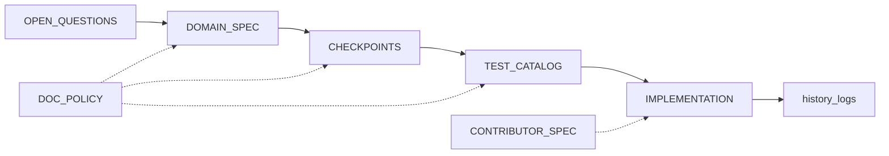

# Workflow map

**Purpose:** Phases from intent to release. Rules: [`./global/SSOT-AND-MAINTENANCE-RULES.md`](./global/SSOT-AND-MAINTENANCE-RULES.md).

**Last updated:** (set when forking)

## Phases

| Phase | Inputs | Outputs | Gate |
|-------|--------|---------|------|
| 0 Charter | Problem, non-goals, compliance | Open questions filled | Named owners |
| 1 Domain | Journeys, invariants | `DOMAIN-OR-PRODUCT-SPEC.md` | No contra-spec work |
| 2 Architecture | Quality, deployment | ADRs, diagrams | Build/test documented |
| 3 Checkpoints | Slices, dependencies | `checkpoints/<date>/` | Acceptance mappable |
| 4 Tests | Acceptance, CI | `TEST-CATALOG.md` | No phantom tests |
| 5 Implementation | Specs, catalog | Code, history | SSOT respected |
| 6 Release | Changelog | Tags, history | Open questions triaged |

## Artifact graph

Stall on human judgment: return to `OPEN-QUESTIONS-AND-HUMAN-INPUT.md`.
