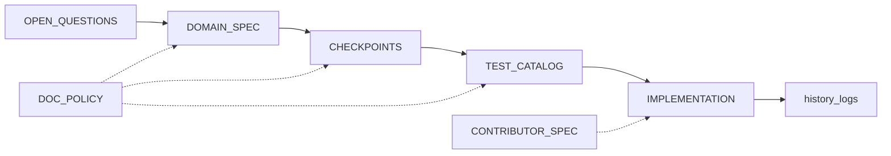

# 工作流地图

**文档作用：** 从意图到交付的阶段顺序。细则：[`./global/SSOT-AND-MAINTENANCE-RULES.md`](./global/SSOT-AND-MAINTENANCE-RULES.md)。

**Last updated：** （分叉时填写）

## 阶段

| 阶段 | 输入 | 产出 | 门禁 |
|------|------|------|------|
| 0 立项 | 问题、非目标、合规 | 开放问题已填 | 具名负责人 |
| 1 域 | 旅程、不变量 | `DOMAIN-OR-PRODUCT-SPEC.md` | 不得违背规格开发 |
| 2 架构 | 质量、部署 | ADR、图示 | 构建/测试已文档化 |
| 3 检查点 | 切片、依赖 | `checkpoints/<日期>/` | 验收可映射检查 |
| 4 测试 | 验收、CI | `TEST-CATALOG.md` | 无「纸上测试」 |
| 5 实现 | 规格、目录 | 代码、历史 | 遵守 SSOT |
| 6 发布 | 变更日志 | 标签、历史 | 开放问题已梳理 |

## 制品关系图

缺人类判断时回到 `OPEN-QUESTIONS-AND-HUMAN-INPUT.md`。
